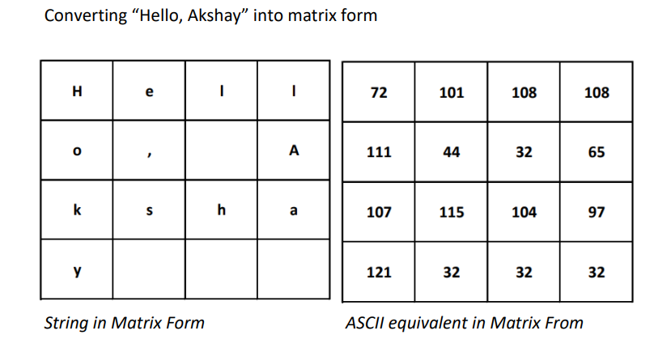
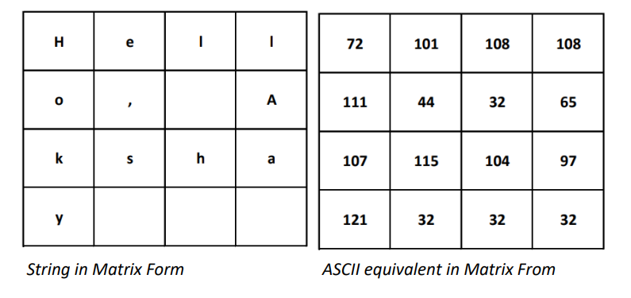
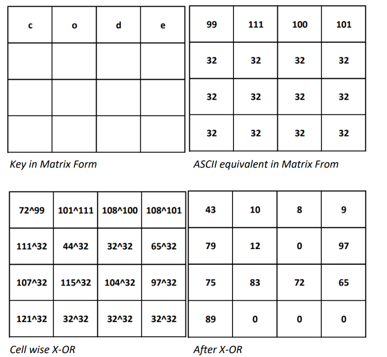
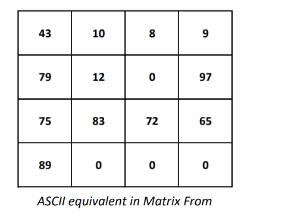
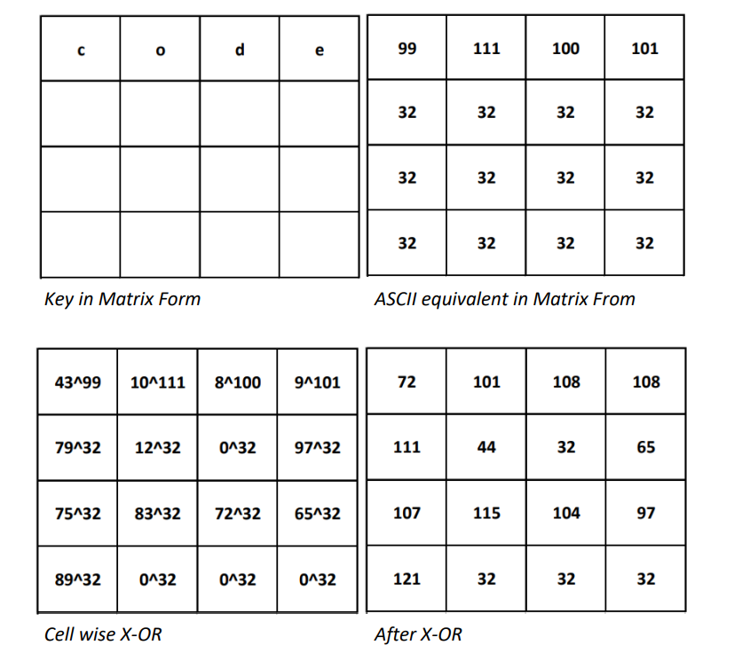
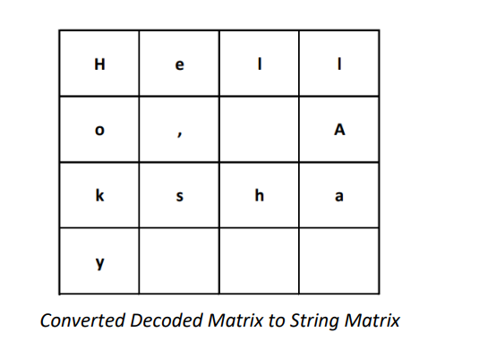
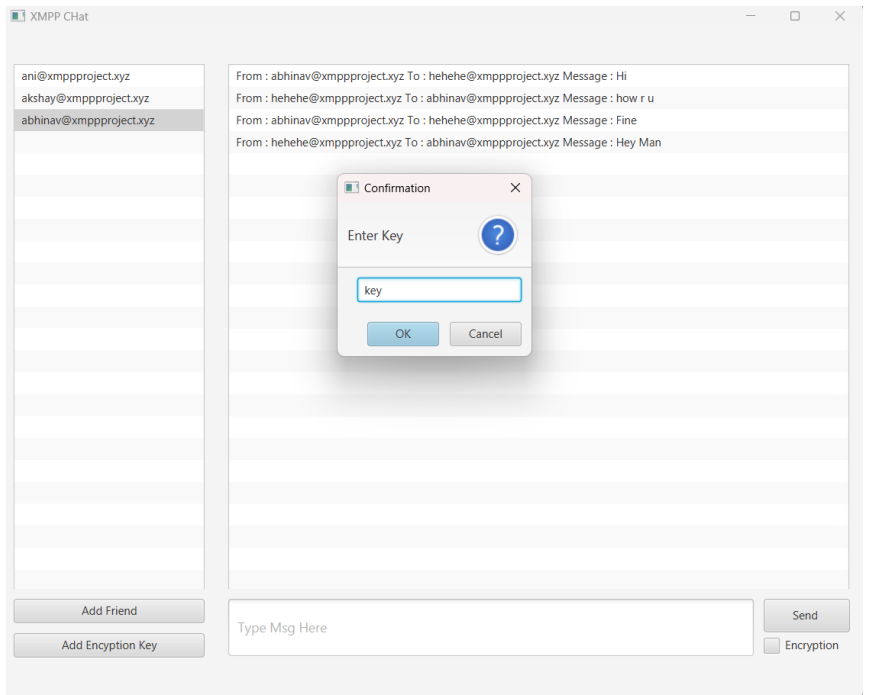
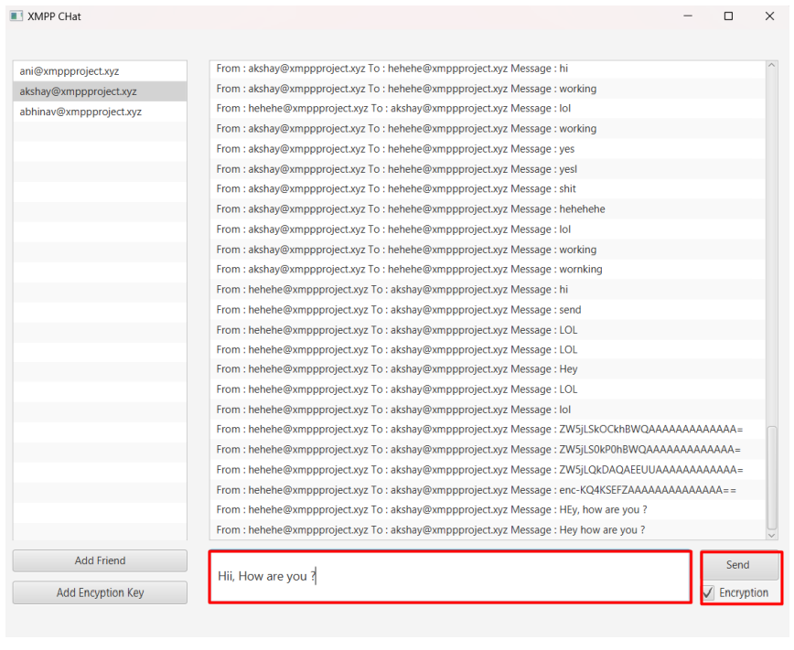

# XMPP Encrypted Chat Java

The main objective of this project is to allow the users to share data and chat with each
other instantly by a secured medium. The primary focus of this application is on the
security and encryption of the data so that third parties may not see the exchange of
personal data. Also, to provide users an alternative to the traditional medium of short
message exchange services like SMS and MMS, which are both unsecure and allow for a
limited exchange of data at a time.

# Encryption
Converting to Matrix form
Given String first is spited into the chunk of 16 char each. These 16 char size chunks
are then mapped to corresponding matrix cell of 4x4 their ASCII equivalent. If the size of
chunk is less than 16 then remaining matrix cells are filled with ‘32’.
Example:
Converting “Hello, Akshay” into matrix form

Encryption
Given String and key is converted in matrix form then each corresponding cells of
matrix is X-ORed to get encrypted matrix then this matrix is converted to the String.
Example: String : “Hello, Akshay” and Key : ”code”

Decryption
Given Encrypted String and key is converted in matrix form then each corresponding
cells of matrix is X-ORed to get decoded matrix then this matrix is converted to the String.
Example: String : “+OaKSHAY” and Key : ”code”

# Screenshots

